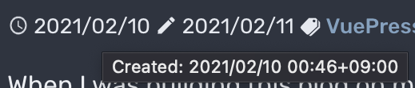

VuePress 以外に移行することを考えたとき、末尾が `.html` なのは微妙かなと思い、変更できるオプションがないか探してみた。

## 末尾の .html を削除できるか

`markdown.pageSuffix` というのがそれかと思ったが、これは Markdown の中に埋め込まれた URL に対しての指定のようで、ページ一覧を作る Component の中で `page.path` のようにパスを参照すると普通に `.html` という末尾になっていた。
[SEO friendly URLs · Issue #78 · vuejs/vuepress](https://github.com/vuejs/vuepress/issues/78) という issue もあるが、進捗がない。
`path.md` → `path.html` のかわりに `path/README.md` → `path/index.html` と変換するというのがワークアラウンドのようなので、その構成に変更してみることにした。
<!--more-->
## renameをfollowして作成日を取得する

ここで気になるのは最終更新日で、git でこの操作をするとすべての記事の最終更新日が rename の操作をした日時になってしまう。
まあまだ記事が少ないからいいのだけれど、作成日も表示することを考えた。

最終更新日は `page.lastUpdated` に入っているが、これは plugin で git で対象ファイルの最後の変更における author date を取得していることが[わかっている](../show-valid-last-updated)。
また、これを GitHub Action でのビルドで取得するためにはすべて fetch しなければならないこともわかっている。

それならすべての履歴を辿っても問題ないのではないだろうか、ということで、git で該当ファイルが作成されたコミットを探し、その author date を取得することにしてみる。

今回のようにファイルが rename された場合には、`--follow` をつければ良いらしい。
もちろん、rename の操作は git が rename として認識していなければならないので、rename と同時に内容を変更したりしてはならない。

```
git log -1 --format=%at --follow path/to/file
```

こうすると commit のリストがずらずらと出てくるので tail してもよいが、[Stack Overflow の回答](https://stackoverflow.com/questions/11533199/git-find-commit-where-file-was-added)にもあるように、`--diff-filter=A` をつけるとファイル追加の commit に絞り込むことができる。

```
git log -1 --format=%at --follow --diff-filter=A path/to/file
```

これでファイルの最初のコミットを取得できる。

## plugin としてページに作成日を持たせる

続いて、これを plugin として実装する。

[Writing a Plugin](https://vuepress.vuejs.org/plugin/writing-a-plugin.html) に説明されているように、plugin は簡単に書ける。
今回の場合は plugin-last-updated の一部を書き換えたいので、これをベースに実装する。

`.vuepress/plugins/created/index.js` というファイルを作って以下のような内容にする。

```js
const path = require('path')
const spawn = require('cross-spawn')

module.exports = (options = {}, context) => ({
  extendPageData ($page) {
    const { transformer, dateOptions } = options
    const timestamp = getGitCreatedTimeStamp($page._filePath)
    const $lang = $page._computed.$lang
    if (timestamp) {
      const created = typeof transformer === 'function'
        ? transformer(timestamp, $lang)
        : defaultTransformer(timestamp, $lang, dateOptions)
      $page.created = created
    }
  }
})

function defaultTransformer (timestamp, lang, dateOptions) {
  return new Date(timestamp).toLocaleString(lang, dateOptions)
}

function getGitCreatedTimeStamp (filePath) {
  let created
  try {
    created = parseInt(spawn.sync(
      'git',
      ['log', '-1', '--format=%at', '--follow', '--diff-filter=A', path.basename(filePath)],
      { cwd: path.dirname(filePath) }
    ).stdout.toString('utf-8')) * 1000
  } catch (e) { /* do not handle for now */ }
  return created
}
```

git を呼び出しているところがポイント。ここで先ほどのコマンドを使用する。

あとは、[Using a Plugin](https://vuepress.vuejs.org/plugin/using-a-plugin.html)で説明されているように、`.vuepress/config.js` で plugins に追加すれば良い。

```js
plugins: [
    [
      require('./plugins/created'),
    ],
```

これで、`page.lastUpdated` と同様に `page.created` で作成日時を表示できるようになる。

## 作成日を表示する

作成日時と最終更新日、2つをタイムゾーンまで含むフォーマットで並べるとものすごく長くなる。これを日付までの表示にして、Last Updated という文言も外してアイコンのみにしておき、title属性で全部含めた文字列を表示するようにした。

`frontmatter.date` として手入力で作成日を記入してソートに使っていたが、これも不要になった。

```vue
<TimeOutlineIcon />
<span :title="$themeConfig.locales[$localePath].created + ': ' + longDate(page.created)">{{shortDate(page.created)}}</span>
<CreateOutlineIcon />
<span :title="$themeConfig.locales[$localePath].lastUpdated + ': ' + longDate(page.lastUpdated)">{{shortDate(page.lastUpdated)}}</span>
```

`TimeOutlineIcon`, `CreateOutlineIcon` は [vue-ionicons](https://www.npmjs.com/package/vue-ionicons) を使っている。
`themeConfig.locales...` の部分はローカライズした文言を config に書いておいて `$localePath` で切り替えている。
`longDate`, `shortDate` はタイムスタンプを長いフォーマット、短いフォーマットで変換する関数。

以下のような表示にすることができた。左側の作成日時にカーソルをあてて title のポップアップが表示されている様子。


