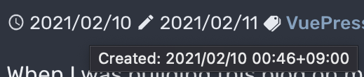

I thought that each blog post having `.html` suffix is not good when I migrate my blog to other system in the future, so I investigated if there is an option to change this.

## How do I remove .html suffix?

I thought `markdown.pageSuffix` option fits this purpose, but it wasn't.
It is an option for embedded URL inside Markdown, and actually `page.path` on the post list Component has `.html` suffix even if this option is set.
There is an open issue [SEO friendly URLs · Issue #78 · vuejs/vuepress](https://github.com/vuejs/vuepress/issues/78), but it has not been proceeded.
I found that there is a workaround for this, so I followed this steps: moving `path.md` to `path/README.md` to change the generated path from `path.html` to `path/index.html`.
<!--more-->
## Follow renames and get created dates

With this change, last updated dates of all posts change to the date and time when rename operation is committed.
Well, I don't have to care about this because there are not so much posts yet, but I decided to show created dates as well.

Last updated date can be retrieved from `page.lastUpdated`, which is implemented on the plugin by getting git author date from the last commit of the target file as [I have already investigated](../show-valid-last-updated).
Also, to get this data on GitHub Actions, all histories should be fetched.

Therefore I thought there is no additional issue to trace the first commit of the file, and I tried to find the author date of the first commit.

If the files are renamed like this time, you only have to append `--follow` option to `git`.
Of course, git must recognize the rename operation is the "rename" to make this work, so you have to avoid renaming and modifying the content of the file at the same time.

```
git log -1 --format=%at --follow path/to/file
```

Now you can see the commit list, and you can get the first commit of the file by piping `tail`, but as explained in [the answer in the Stack Overflow](https://stackoverflow.com/questions/11533199/git-find-commit-where-file-was-added), `--diff-filter=A` filters the list to only the commit that adds the file.

```
git log -1 --format=%at --follow --diff-filter=A path/to/file
```

Finally I could get the first commit of the file.

## Let page have created date by plugin

Then, I implemented this as a plugin.

Plugins can be easily implemented, as explained in [Writing a Plugin](https://vuepress.vuejs.org/plugin/writing-a-plugin.html).
I'd like to change just a part of the plugin-last-updated, so I wrote the plugin based on it.

I created a file named `.vuepress/plugins/created/index.js` and worte like below.

```js
const path = require('path')
const spawn = require('cross-spawn')

module.exports = (options = {}, context) => ({
  extendPageData ($page) {
    const { transformer, dateOptions } = options
    const timestamp = getGitCreatedTimeStamp($page._filePath)
    const $lang = $page._computed.$lang
    if (timestamp) {
      const created = typeof transformer === 'function'
        ? transformer(timestamp, $lang)
        : defaultTransformer(timestamp, $lang, dateOptions)
      $page.created = created
    }
  }
})

function defaultTransformer (timestamp, lang, dateOptions) {
  return new Date(timestamp).toLocaleString(lang, dateOptions)
}

function getGitCreatedTimeStamp (filePath) {
  let created
  try {
    created = parseInt(spawn.sync(
      'git',
      ['log', '-1', '--format=%at', '--follow', '--diff-filter=A', path.basename(filePath)],
      { cwd: path.dirname(filePath) }
    ).stdout.toString('utf-8')) * 1000
  } catch (e) { /* do not handle for now */ }
  return created
}
```

The important part of this code is calling `git`. I use the last command here.

Then, as explained in [Using a Plugin](https://vuepress.vuejs.org/plugin/using-a-plugin.html), I just have to add this plugin to `.vuepress/config.js`.

```js
plugins: [
    [
      require('./plugins/created'),
    ],
```

Now I can show created date by using `page.created` as same as `page.lastUpdated`.

## Show created date

Text that has both created date and last updated date with the format that contains timezone is too long to show in one line.
I changed this to show only date part from a timestamp, remove "Last updated" label, and show the full text on popup by title attribute.

I was using `frontmatter.date` to sort posts by setting it manually but it became useless property now.

```vue
<TimeOutlineIcon />
<span :title="$themeConfig.locales[$localePath].created + ': ' + longDate(page.created)">{{shortDate(page.created)}}</span>
<CreateOutlineIcon />
<span :title="$themeConfig.locales[$localePath].lastUpdated + ': ' + longDate(page.lastUpdated)">{{shortDate(page.lastUpdated)}}</span>
```

`TimeOutlineIcon`, `CreateOutlineIcon` are from [vue-ionicons](https://www.npmjs.com/package/vue-ionicons).
`themeConfig.locales...` part is the localized message written in the config and can be switched by selected locale (`$localePath`).
`longDate`, `shortDate` are local functions that converting timestamps to long format and short format.

Finally I could show like the following screenshot.
This is taken when I moved cursor on the created date on the left and title popup is shown.


